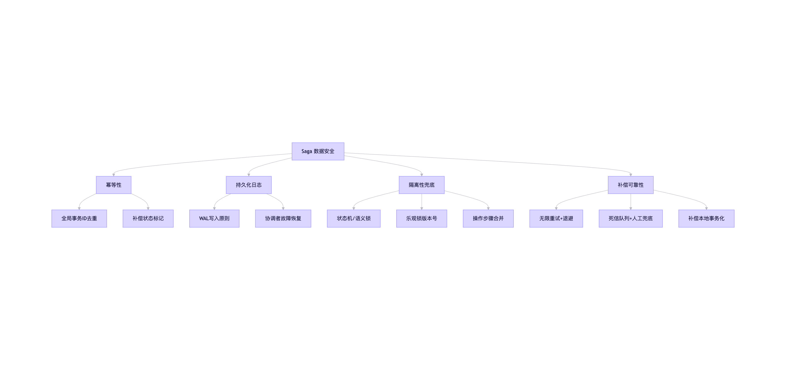
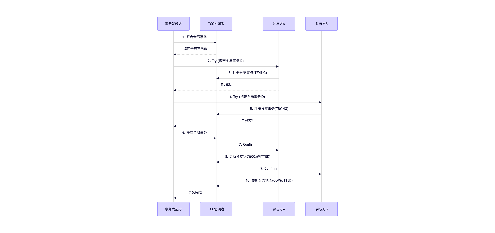

本地使用docker-compose 测试分布式事务
dtm+go-zero
开发新功能步骤
是的，你现在的架构思路非常清晰：

## 整体架构设计
## micro-go-zero 项目架构分析

### 一、整体架构图

```
┌─────────────────────────────────────────────────────────────────────────────────┐
│                            Client / Frontend                                     │
└─────────────────────────────────┬───────────────────────────────────────────────┘
                                  │ HTTP (JSON)
                                  ▼
┌──────────────────────────────────────────────────────────────────────────────────┐
│                              api-gateway (Port 8888)                              │
│                              Gin HTTP Framework                                   │
│  ┌──────────────┐  ┌───────────────────────────────────────────────────────────┐ │
│  │  中间件层     │  │  路由层 /api/v1                                          │ │
│  │  ├─ CORS()   │  │  ┌───────────────────┐  ┌──────────────────────────────┐ │ │
│  │  └─ Auth()   │  │  │ /user/*           │  │ /order/*                    │ │ │
│  │               │  │  │ Login/Logout      │  │ CreateOrder (DTM Saga)     │ │ │
│  │               │  │  │ CreateUser/Update │  │ CommitPay/StateCheck/Cancel│ │ │
│  │               │  │  │ WxLogin/Refresh   │  │                              │ │ │
│  │               │  │  │ UserList/Info     │  │                              │ │ │
│  │               │  │  └────────┬──────────┘  └──────────────┬───────────────┘ │ │
│  └──────────────┘  └────────────┼─────────────────────────────┼─────────────────┘ │
└─────────────────────────────────┼─────────────────────────────┼───────────────────┘
                                  │                             │
                    ┌─────────────┼─────────────────────────────┼──────────────┐
                    │             │                             │              │
                    ▼             ▼                             ▼              │
         ┌─────────────────┐  ┌──────────────────┐  ┌────────────────────┐  │
         │   user-rpc      │  │   order-rpc      │  │   stock-rpc        │  │
         │   (Port 8080)   │  │   (Port 8081)    │  │   (Port 8082)     │  │
         │                 │  │                  │  │                    │  │
         │ Login/Logout    │  │ CreateOrder      │  │ DeductStock (Saga) │  │
         │ Create/Update   │  │ CancelOrder(补偿)│  │ RollbackStock(补偿)│  │
         │ UserInfo/List   │  │ CommitPay        │  │ QueryStock         │  │
         │ WxLogin/Refresh │  │ StateCheck       │  │ BatchQueryStock    │  │
         └────────┬────────┘  └────────┬─────────┘  └────────┬───────────┘  │
                  │                    │                      │              │
                  ▼                    ▼                      ▼              │
         ┌──────────────────────────────────────────────────────────────┐   │
         │                        etcd                                  │   │
         │                  服务注册与发现                                │   │
         └──────────────────────────────────────────────────────────────┘   │
                                                                           │
         ┌──────────────────────────────────────────────────────────────┐   │
         │                    DTM 协调器                                 │◄──┘
         │              Saga 分布式事务管理                               │
         │           API: 36789 (HTTP) / 36790 (gRPC)                    │
         └─────────────────────────┬────────────────────────────────────┘
                                   │
                                   ▼
         ┌──────────────────────────────────────────────────────────────┐
         │                     MySQL (单实例)                           │
         │  ┌───────────┐  ┌───────────┐  ┌───────────┐  ┌─────────┐ │
         │  │ user_db   │  │ order_db  │  │ stock_db  │  │ dtm     │ │
         │  │ user_info │  │ order_info│  │ saga_     │  │(DTM自用)│ │
         │  │           │  │ saga_     │  │ branch_   │  │         │ │
         │  │           │  │ global_   │  │ trans     │  │         │ │
         │  │           │  │ trans     │  │           │  │         │ │
         │  └───────────┘  └───────────┘  └───────────┘  └─────────┘ │
         └──────────────────────────────────────────────────────────────┘
```

### 二、核心架构说明

| 层次 | 组件 | 技术选型 | 说明 |
|------|------|---------|------|
| **接入层** | api-gateway | Gin + go-zero zrpc client | HTTP API 统一入口，路由分发，中间件处理 |
| **服务层** | user-rpc / order-rpc / stock-rpc | go-zero zrpc server | 三个独立微服务，通过 gRPC 通信 |
| **协调层** | DTM | dtm-labs/dtm | Saga 分布式事务协调器 |
| **注册层** | etcd | bitnami/etcd:3.5 | 服务注册与发现 |
| **持久层** | MySQL 8.0 | GORM (ORM) | 4个业务数据库（user_db, order_db, stock_db, dtm） |

### 三、请求流转示例（以创建订单为例）

```
客户端 → api-gateway(POST /api/v1/order/create)
  → DTM: GenGid() 生成全局事务ID
  → api-gateway 编排 Saga:
     分支1: stock-rpc.DeductStock (正向: 扣减库存)
     分支2: order-rpc.CreateOrder (正向: 创建订单)
  → 提交 DTM Saga 事务
  → DTM 按序调用分支 → 任一失败则自动执行补偿
     (stock-rpc.RollbackStock / order-rpc.CancelOrder)
  → 返回结果给客户端
```

### 四、优缺点分析

#### ✅ 优点

1. **微服务架构清晰**：按业务边界划分 user/order/stock 三个独立服务，职责单一
2. **分布式事务完善**：采用 DTM Saga 模式，具备完整的幂等机制（乐观锁 + 版本号）、指数退避重试、分支事务追踪日志
3. **通用 Handler 模式**：`HandleJSON/HandleQuery` 泛型封装消除了大量模板代码
4. **基础设施完善**：etcd 服务发现 + Docker Compose 一键部署，开发体验良好
5. **数据层设计规范**：Repository 模式 + 乐观锁并发控制 + 完整的补偿日志表（`saga_global_transaction` + `saga_branch_transaction`）
6. **使用 go-zero**：成熟的微服务框架，内置服务治理、自适应负载均衡等能力
7. **CORS 支持**：方便前后端分离开发
8. **微信生态集成**：预留了微信小程序登录接口


## 新功能开发流程

**第一步：加 Gin 对外接口**（在 api-gateway 中）
- `types/` 定义请求/响应 struct
- `handler/` 写 handler 函数，调用 RPC client
- `router.go` 注册路由

**第二步：写 RPC 逻辑**（在对应 rpc 服务中）
- `xxx.proto` 定义 protobuf 协议
- `internal/logic/` 实现业务逻辑
- 注册到 server，对外暴露 gRPC 接口

## 补充说明


你的开发流程确实简化了——api-gateway 只做 HTTP 协议转 gRPC 的薄层，不涉及业务逻辑，业务全部收敛在 RPC 服务中。符合微服务的单一职责原则。

## 项目分布式事务现状分析

经过全面阅读项目代码，以下是当前分布式事务实现的完整梳理：

---

### 一、技术选型

| 项目 | 方案 |
|------|------|
| 协调器 | [DTM](https://github.com/dtm-labs/dtm) v1.15.0 |
| 事务模式 | **Saga** |
| DTM 存储后端 | MySQL（`dtm` 数据库） |
| 通信协议 | gRPC（dtmgrpc） |
| 关键依赖库 | `dtmgrpc`（api-gateway）、`dtmcli`（间接依赖） |

---

### 二、整体架构


### 三、核心流程（Saga 编排）


### TCC 流程



代码位于 `api-gateway/handler/order_handler.go:CreateOrder`：

1. **生成全局事务 ID**：`dtmgrpc.MustGenGid(svcCtx.Config.DTMEndpoint)`
2. **构建 Saga**：`dtmgrpc.NewSagaGrpc(DTMEndpoint, gid)`
3. **添加分支**（按顺序）：
   - **分支1**：`stock.Stock/DeductStock` → 补偿 `stock.Stock/RollbackStock`
   - **分支2**：`order.Order/CreateOrder` → 补偿 `order.Order/CancelOrder`
4. **提交事务**：`saga.Submit()`（同步等待）

**执行顺序**：先扣库存 → 再创建订单。任一失败则逆序执行补偿。

---

### 四、项目现状（完成度评估）

#### ✅ 已完成部分

| 组件 | 状态 | 说明 |
|------|------|------|
| DTM 服务部署 | ✅ | docker-compose + Dockerfile + init-dtm-db.sh |
| 数据库初始化 | ✅ | `dtm` 数据库自动创建 |
| Proto 定义 | ✅ | stock-rpc 定义了 DeductStock/RollbackStock |
| Proto 定义 | ✅ | order-rpc 定义了 CreateOrder/CancelOrder |
| Saga 编排逻辑 | ✅ | api-gateway 侧编排代码完整 |
| 库存字段设计 | ✅ | DTO 含 `totalStock`/`availableStock`/`lockedStock` 三种状态 |
| 库存流水字段 | ✅ | proto 预留了 `orderNo` 作为幂等键 |

#### ⚠️ TODO / 未实现部分

| 组件 | 状态 | 问题 |
|------|------|------|
| **stock-rpc DeductStock** | ❌ TODO | 仅注释，未实现 barrier 幂等扣减逻辑 |
| **stock-rpc RollbackStock** | ❌ TODO | 仅注释，未实现 barrier 幂等回滚逻辑 |
| **order-rpc CreateOrder** | ❌ TODO | 空实现，未写入订单表 |
| **order-rpc CancelOrder** | ❌ TODO | 空实现，未取消订单 |
| **order-rpc OrderCommitPay** | ❌ TODO | 空实现，支付提交逻辑未完成 |
| **order-rpc OrderStateCheck** | ❌ TODO | 空实现，订单状态检测未完成 |
| **dtmcli/dtmgrpc 依赖** | ❌ 缺失 | order-rpc 和 stock-rpc 的 go.mod **未引入** `dtmgrpc`/`dtmcli`，无法使用 Barrier 机制 |
| **dtm 回调可达性** | ⚠️ 未验证 | DTM 需要能回调 stock-rpc:8082 和 order-rpc:8081，docker 内网是否可达需确认 |
| **业务数据库表** | ❌ 缺失 | `order_db`/`stock_db` 数据库已创建，但业务表结构未定义 |
| **DTM 自定义配置** | ⚠️ 可能缺失 | Dockerfile 引用了 `config.yml`，但 `/dtm/` 目录下未看到该文件 |

---

### 五、潜在问题分析

1. **order-rpc 的 `stock-rpc` replace 依赖**：order-rpc 的 go.mod 中 `replace stock-rpc => ../stock-rpc`，意味着 order-rpc 依赖了 stock-rpc。但 order-rpc 的 `CreateOrder` 中是否需要调用 stock-rpc？当前代码未体现。如果不需要，建议移除该依赖。

2. **DTM 回调地址配置**：当前 Saga 分支地址通过 `svcCtx.Config.StockRpcTarget` 和 `svcCtx.Config.OrderRpcTarget` 传给 DTM。这些地址需确保 DTM 容器能从内部网络访问到。当前 `api-gateway/etc/config.yaml` 中需要配置为 docker-compose 服务名（如 `stock-rpc:8082`）。

3. **库存模型设计**：proto 中设计了 `availableStock`（可用库存）和 `lockedStock`（锁定库存）两个字段，典型的两阶段库存设计。正向操作：`availableStock--`，`lockedStock++`；补偿操作：`availableStock++`，`lockedStock--`。但当前只是设计，未实现。

---

### 六、后续需要完善的工作

1. **补齐 dtmcli/dtmgrpc 依赖**到 order-rpc 和 stock-rpc
2. **实现 stock-rpc** 的 DeductStock（带 Barrier 幂等）和 RollbackStock
3. **实现 order-rpc** 的 CreateOrder 和 CancelOrder
4. **创建业务数据库表结构**（order 表、stock 表、stock_flow_log 流水表）
5. **验证 DTM 回调网络可达性**
6. **补充 OrderCommitPay / OrderStateCheck** 完整逻辑


### 对分布式事务的理解
**当业务跨越了数据库实例边界（无论是因为公司、地区、国家，还是仅仅因为微服务拆分），无法用单个 MySQL 事务保证一致性时，才被迫采用分布式事务。它不是"升级方案"，而是在一致性与可用性之间做出妥协的无奈之选。**